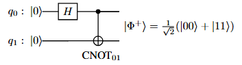

============
Introduction
============

.. contents:: Table of Contents
   :local:

Overview
========

Quantum computing has the potential to revolutionize computing beyond the reach of classical computers. Currently, the manufacturing of quantum hardware is in the
infancy stage, called the Noisy Intermediate-Scale Quantum (NISQ) era, meaning:

1. They can only support a limited number of qubits.
2. Gate operations can be imprecise (i.e., “noisy”). 

Given these constraints, **automated** methods for designing circuits are increasingly important. Traditional “hand-crafted” circuits are often inefficient and not scalable, especially when we want to build more advanced or large-scale quantum algorithms.

In this module, we introduce how **reinforcement learning (RL)** can help automate quantum circuit design:

- **What is the task?** We want to find the best sequence of gates that produces a desired quantum state or operation.
- **Why use RL?** RL explores different possible circuits step by step—applying gates, observing the outcome, then adjusting its strategy over many trials.

We explore reinforcement learning methods to automate the task of quantum circuit search. Our contributions can be summarized as follows:

- We present three generic Markov Decision Process (MDP) modelings for the quantum circuit design task.

- We study :math:`10` quantum circuit design tasks: :math:`4` Bell states, SWAP gate, iSWAP gate, CZ gate, GHZ gate, Z gate and Toffoli gate, respectively, given a universal gate set { :math:`H, T, \text{CNOT}` }.

Problem Formulation
===================

To make things clear, let's consider a simple task: designing a circuit that creates the Bell state :math:`\ket{\Phi^+}`

.. _bellcircuit:

   A quantum circuit to generate Bell state :math:`\ket{\Phi^+}`.

Task: Quantum Circuit Design
==============================

Given two qubits with initial state :math:`\ket{q_1q_0} = \ket{00}` and a universal gate set :math:`G =` { :math:`H, T, \text{CNOT}` }, the goal is to find a quantum circuit 
that generates the Bell state :math:`\ket{\Phi^+}`: 

.. _bell:
.. math::
   \ket{\Phi^+} = \frac{1}{\sqrt{2}} \left( \ket{00} + \ket{11} \right)
   :label: eq:1
   
The target quantum circuit to generate :math:`\ket{\Phi^+}` whose matrix representation is:

.. _U:
.. math::
   U &= \text{CNOT}_{01} \cdot (H \otimes I) \\
   &=
   \begin{pmatrix}
   1 & 0 & 0 & 0 \\
   0 & 1 & 0 & 0 \\
   0 & 0 & 0 & 1 \\
   0 & 0 & 1 & 0 
   \end{pmatrix}
   \cdot \left(
   \frac{1}{\sqrt{2}}
   \begin{pmatrix}
      1 & 1\\
      1 & -1
   \end{pmatrix}
   \otimes
   \begin{pmatrix}
      1 & 0\\
      0 & 1\\
   \end{pmatrix} \right)\\
   &=
   \frac{1}{\sqrt{2}}
   \begin{pmatrix}
   1 & 0 & 1 & 0 \\
   0 & 1 & 0 & 1 \\
   0 & 1 & 0 & -1 \\
   1 & 0 & -1 & 0 
   \end{pmatrix}
   :label: eq:2

Note that :math:`\ket{\Phi^+} = U~\ket{00}`.

.. [Paper] Wang, Z.; Feng, C.; Poon, C.; Huang, L.; Zhao, X.; Ma, Y.; Fu, T.; and Liu, X.-Y. 2025. Reinforcement learning for quantum circuit design: Using matrix representations. In arXiv, 2501.16509. https://arxiv.org/abs/2501.16509.