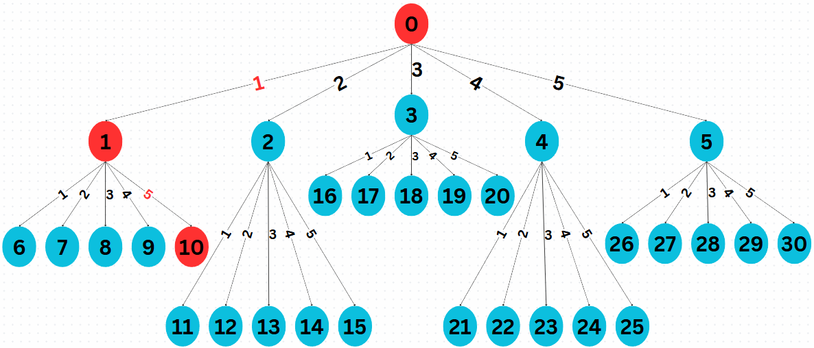
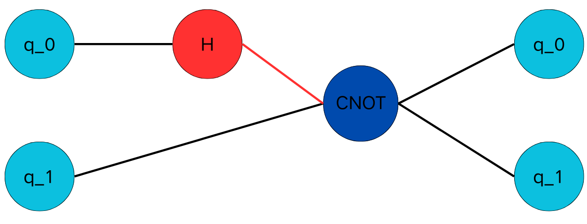

=======================================
Markov Decision Process (MDP) Modelings
=======================================

.. contents:: Table of Contents
   :local:

We propose three different ways to model the quantum circuit design (QCD) task within a Markov Decision Process (MDP) framework:

1. **Matrix Representation**
2. **Reverse Matrix Representation**
3. **Tensor Network (TN) Representation**

Each representation defines the state space, actions, and reward functions. We will use the Bell-state circuit (:ref:`Figure 1 <fig-bell-circuit>`) as a running example to illustrate these approaches.

Matrix Representation
=====================

.. _bellstatematrixtree:

   State tree in matrix representation for searching the circuit in :numref:`bellcircuit`.

- Actions :math:`\mathcal{A}` = { :math:`H_0, H_1, T_0, T_1, \text{CNOT}_{01}` }, since :math:`H` and :math:`T` can be executed on either :math:`q_0` or :math:`q_1`. 
  An action :math:`a` in :math:`\mathcal{A}` is represented as a matrix :math:`\mathit{A} \in \mathbb{C}^{4 \times 4}`. 

- State Space :math:`\mathcal{S}`: The initial state is :math:`U_0 = I_{4}` and the terminal state is :math:`U` given in :ref:`(2) <U>`. Let :math:`S` be the current state 
  (a node in :numref:`bellstatematrixtree`), :math:`A \in \mathcal{A}` be the action, then the resulting state at a child node :math:`S^{'}` is given by

  .. math::
     S^{'} = A \cdot S
     :label: eq:3

  The state space :math:`\mathcal{S}` is a tree in :numref:`bellstatematrixtree`. The connecting lines 1, 2, 3, 4, and 5 correspond to the five actions in 
  :math:`\mathcal{A}`. At the initial state :math:`S_0 = I_4`, taking an action :math:`a \in \mathcal{A}` will generate :math:`5` states { :math:`S_1, S_2, S_3, S_4, S_5` }. 
  Then, taking a second action :math:`a \in \mathcal{A}` at a state :math:`S \in` { :math:`S_1, S_2, S_3, S_4, S_5` } will generate :math:`25` states { 
  :math:`S_6, S_7, \ldots, S_{30}` }. Thus, :math:`\mathcal{S}` has a total of :math:`31` states.

- Reward function :math:`\mathcal{R}`: At state :math:`S_1`, taking action :math:`a = \text{CNOT}_{01}`, the reward is :math:`R(s = S_1, a = \text{CNOT}_{01})= 100`; 
  otherwise, :math:`R(s, a)=0`. 

Example for :numref:`bellcircuit`
---------------------------------
Given initial state :math:`S_0 = I_4`, let us consider the optimal trajectory :math:`S_0 \rightarrow S_1 \rightarrow S_{10}`.

**State after taking the first action** :math:`a = H_0`,

.. math::
   S_1 = (H_0 \otimes I) S_0
   =\frac{1}{\sqrt{2}}
   \begin{pmatrix}
   1 & 0 & 1 & 0 \\
   0 & 1 & 0 & 1 \\
   1 & 0 & -1 & 0 \\
   0 & 1 & 0 & -1 
   \end{pmatrix}.
   :label: eq:4

**State after taking the second action** :math:`a = \text{CNOT}_{01}`,

.. math::
   S_{10} &= \text{CNOT}_{01} \cdot S_1 \\
   & =\frac{1}{\sqrt{2}} \begin{pmatrix}
   1 & 0 & 0 & 0 \\
   0 & 1 & 0 & 0 \\
   0 & 0 & 0 & 1 \\
   0 & 0 & 1 & 0 
   \end{pmatrix}
   \begin{pmatrix}
   1 & 0 & 1 & 0 \\
   0 & 1 & 0 & 1 \\
   1 & 0 & -1 & 0 \\
   0 & 1 & 0 & -1 
   \end{pmatrix} = U,
   :label: eq:5

which corresponds to the target circuit in :ref:`(2) <U>`.

**Advantage**: Different sequences of quantum gates may result in the same matrix state, thus this matrix representation would reduce the state space.
  
**Disadvantage**: RL agent needs to be trained for each target matrix, even though different circuits may share similar or identical intermediate states. This approach makes the training process repetitive.

Reverse Matrix Representation
=============================

.. _bellstatereversematrixtree:
.. figure:: ./images/bell_state_reverse_matrix.png
   :width: 50%
   :align: center
   :class: custom-img

   State tree in reverse matrix representation for searching the circuit in :ref:`Fig. 1 <bellcircuit>`.

- Actions :math:`\mathcal{A}^{-1}` = { :math:`H_0^{-1}, H_1^{-1}, T_0^{-1}, T_1^{-1}, \text{CNOT}_{01}^{-1}` }, since :math:`H^{-1}` and :math:`T^{-1}` can be executed 
  on either :math:`q_0` or :math:`q_1`. An action :math:`a` in :math:`\mathcal{A}^{-1}` is represented as a matrix :math:`\mathit{A}^{-1} \in \mathbb{C}^{4 \times 4}`. 

- State Space :math:`\mathcal{S}`: The initial state is :math:`S_0^{-1} = U` given in :ref:`(2) <U>` and the terminal state is :math:`I_4`. Let :math:`S^{-1}` be the current 
  state (a node in :numref:`bellstatereversematrixtree`), :math:`A^{-1} \in \mathcal{A}^{-1}` be the action, then the resulting state at a child node :math:`S^{'-1}` 
  is given by

  .. math::
     S^{'-1} = A^{-1} \cdot S^{-1}
     :label: eq:6

  The state space :math:`\mathcal{S}^{-1}` is a tree in :numref:`bellstatereversematrixtree`. The connecting lines 1, 2, 3, 4, and 5 correspond to the five actions in 
  :math:`\mathcal{A}^{-1}`. At the initial state :math:`S_0 = U`, taking an action :math:`a \in \mathcal{A}^{-1}` will generate :math:`5` states { :math:`S_1^{-1}, S_2^{-1}, S_3^{-1}, S_4^{-1}, S_5^{-1}` }. 
  Then, taking a second action :math:`a \in \mathcal{A}^{-1}` at a state :math:`S \in` { :math:`S_1^{-1}, S_2^{-1}, S_3^{-1}, S_4^{-1}, S_5^{-1}` } will generate :math:`25` states { 
  :math:`S_6^{-1}, S_7^{-1}, \ldots, S_{30}^{-1}` }. Thus, :math:`\mathcal{S}^{-1}` has a total of :math:`31` states.

- Reward function :math:`\mathcal{R}`: At state :math:`S_5^{-1}`, taking action :math:`a = H_0^{-1}`, the reward is :math:`R(s = S_5^{-1}, a = H_0^{-1})= 100`; 
  otherwise, :math:`R(s, a)=0`. 

Example for :numref:`bellcircuit`
---------------------------------
Given initial state :math:`S_0^{-1} = U` in :ref:`(2) <U>`, let us consider the optimal trajectory :math:`S_0^{-1} \rightarrow S_5^{-1} \rightarrow S_{26}^{-1}`.

**State after taking the first action** :math:`a = \text{CNOT}_{01}^{-1}`,

.. math::
   & S_5^{-1} = \text{CNOT}_{01}^{-1} \cdot S_0^{-1} \\
   & =\begin{pmatrix}
   1 & 0 & 0 & 0 \\
   0 & 1 & 0 & 0 \\
   0 & 0 & 0 & 1 \\
   0 & 0 & 1 & 0 
   \end{pmatrix}
   \frac{1}{\sqrt{2}}
   \begin{pmatrix}
   1 & 0 & 1 & 0 \\
   0 & 1 & 0 & 1 \\
   0 & 1 & 0 & -1 \\
   1 & 0 & -1 & 0 
   \end{pmatrix} 
   \\ & 
   = \frac{1}{\sqrt{2}}
   \begin{pmatrix}
   1 & 0 & 1 & 0 \\
   0 & 1 & 0 & 1 \\
   1 & 0 & -1 & 0 \\
   0 & 1 & 0 & -1 
   \end{pmatrix}.
   :label: eq:7

**State after taking the second action** :math:`a = H_0^{-1}`,

.. math::
   & S^{-1}_{26} = (H_0^{-1}\otimes I) S_5^{-1} \\
   & =\frac{1}{2}\begin{pmatrix}
   1 & 0 & 1 & 0 \\
   0 & 1 & 0 & 1 \\
   1 & 0 & -1 & 0 \\
   0 & 1 & 0 & -1 
   \end{pmatrix}
   \begin{pmatrix}
   1 & 0 & 1 & 0 \\
   0 & 1 & 0 & 1 \\
   1 & 0 & -1 & 0 \\
   0 & 1 & 0 & -1 
   \end{pmatrix} = 
   I_4.
   :label: eq:8

To construct the target circuit, one can reverse the ordering of actions and take the inverse of each action. In this example, gate :math:`\text{CNOT}_{01}^{-1}` 
is followed by gate :math:`H_{0}^{-1}`. Therefore, the result is :math:`H_{0}` followed by :math:`\text{CNOT}_{01}^{-1}` , which corresponds to the target circuit 
in :numref:`bellcircuit`.

Tensor Network Representation
=============================

.. _belltensor:

   TN representation of :ref:`Fig. 1 <bellcircuit>`.

.. _belltensortree:
.. figure:: ./images/bell_tensor_tree.png
   :width: 50%
   :align: center
   :class: custom-img

   State tree in TN representation for searching the circuit in :ref:`Fig. 1 <bellcircuit>`.

The Tensor Network (TN) is a powerful representation for quantum circuits. A tensor network is a collection of interconnected tensors. A single-qubit gate can be 
represented as a 2-order tensor, while a double-qubit gate can be represented as a 4-order tensor. For example, we convert the circuit in :numref:`bellcircuit` to 
:numref:`belltensor`.

Consider :numref:`bellcircuit` and a universal gate set :math:`G =` { :math:`H_0, H_1, T_0, T_1, \text{CNOT}_{01}` }. The gate list is 
:math:`L =` { :math:`H_0,H_1, T_0,T_1, \text{CNOT}` }. We allow up to two gates for demonstration purpose. 

- Actions :math:`\mathcal{A} =` { :math:`H_0, H_1, T_0, T_1, \text{CNOT}_{01}, (H_0, H_1), (H_0, T_1), (H_1, T_0), (T_0, T_1), (T_0, \text{CNOT}_{01}), (\text{CNOT}_{01}, T_0),` 
  :math:`(T_1, \text{CNOT}_{01}), (\text{CNOT}_{01}, T_1), (H_0, \text{CNOT}_{01}), (\text{CNOT}_{01}, H_0), (H_1, \text{CNOT}_{01}), (\text{CNOT}_{01}, H_1)` }.
  There are 17 different actions in total. Taking action :math:`(H_0, \text{CNOT}_{01})` results in the TN representation in :numref:`bellcircuit`.

- State space :math:`\mathcal{S}`: The initial state is :math:`S_0 = \ket{00}`, and the terminal state is :math:`\ket{\Phi^+}` given in :ref:`(1) <bell>`. Let :math:`S` 
  be the current state (a node in :numref:`belltensortree`), :math:`A \in \mathcal{A}` be an action, then the resulting state at a child node :math:`S^{'}` is given by:

  .. math::
     S^{'} = A \cdot S
     :label: eq:9
    
  The state space :math:`\mathcal{S}` is represented as a tree in :numref:`belltensortree`. The connecting lines :math:`1, 2, 3, \dots, 17` correspond to the 17 actions 
  in :math:`\mathcal{A}`. At the initial state :math:`S_0 = \ket{00}`, taking an action :math:`A \in \mathcal{A}` will generate :math:`17` states :math:`\{S_1, S_2, S_3, \dots, S_{17}\}`
  Thus, :math:`\mathcal{S}` contains a total of :math:`18` states.

Example for :numref:`bellcircuit`
---------------------------------
Given initial state :math:`S_0 = \ket{00}`, we consider the optimal trajectory :math:`S_0 \rightarrow S_{14}`.

**State after the action** :math:`a = (H_0, \text{CNOT}_{01})`,

.. math::
   S_{14} &= \text{CNOT}_{01} \cdot (H \otimes I) \cdot S_0 \\
   &= \text{CNOT}_{01} \cdot \left( \frac{1}{\sqrt{2}} \left( \ket{00} + \ket{10} \right) \right) \\
   &= \frac{1}{\sqrt{2}} \left( \ket{00} + \ket{11} \right).
   :label: eq:10
   
which corresponds to the target circuit in :ref:`(2) <U>`.