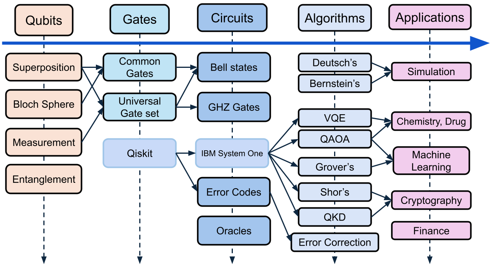

============
Introduction
============

.. contents:: Table of Contents
   :local:

Description
===========
Welcome to `Quantum Education Modules <https://github.com/YangletLiu/CSCI4961_labs_projects>`_! 

`Quantum Education Modules <https://github.com/YangletLiu/CSCI4961_labs_projects>`_ takes an open-source, hands-on approach to make quantum computing 
intuitive and accessible for students. 

The modules  include labs, experiments, and projects, allowing you to first learn quantum concepts interactively through simulations using Jupyter notebooks. 
Then, you will have the opportunity to explore with IBM Quantum System One. RPI students could use the on campus quantum computer. 

Through these modules, we provide:

- **Clear, step-by-step guidance**: Clear instructions to guide you through each module.
- **Friendly learning paths**: Friendly to newcomers, with background of trigonometric functions.
- **Practical experience**: Opportunities to engage directly with real quantum hardware.

Motivation
==========
The emerging field of quantum computing offers the opportunity for new career paths, research, and collaboration. However, the complexity of the field can be a barrier 
to entry for interested students.

Our goal is to make quantum computing more approachable and engaging for newcomers. We aim to break down the barrier to entry by offering a hands-on approach that allows
you to learn and explore quantum concepts easily.

By integrating these modules into existing and future quantum courses, we hope to support you in developing key quantum computing skills as well as prepare you for exciting
opportunities in the field!