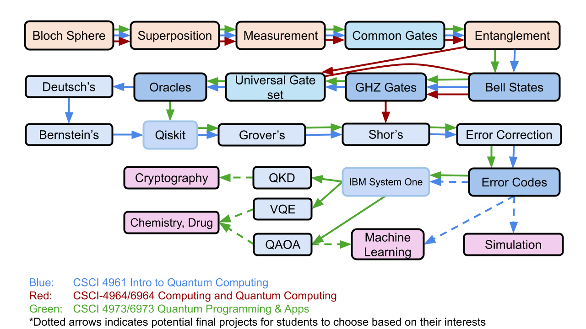

How to Use
==========

The modules can be viewed pre-run on this site or run locally by downloading the Jupyter notebooks from the `GitHub <https://github.com/YangletLiu/quantum-education-modules>`_.

Students can explore any module freely. For students new to quantum computing, we offer example learning paths based on content from RPI courses to guide your journey.

